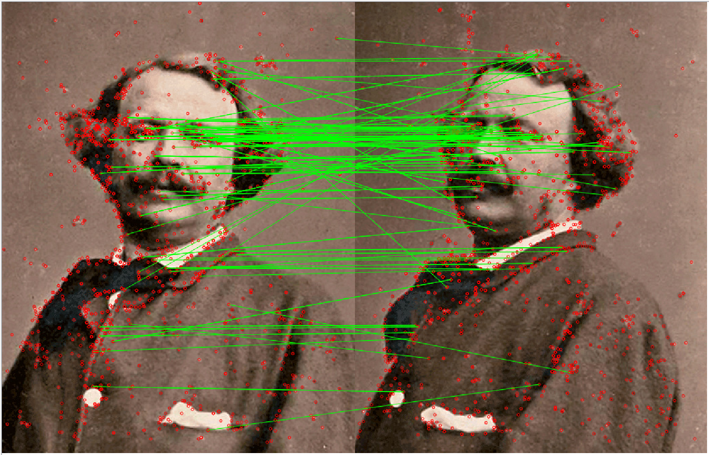
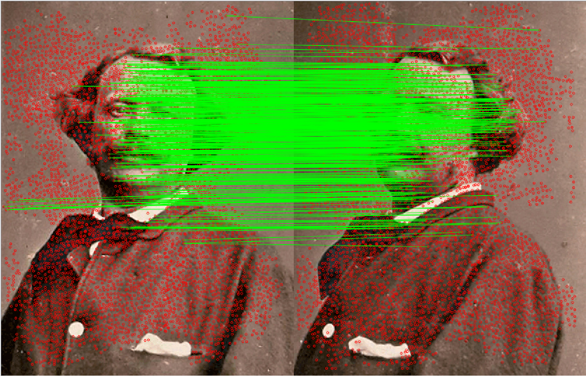
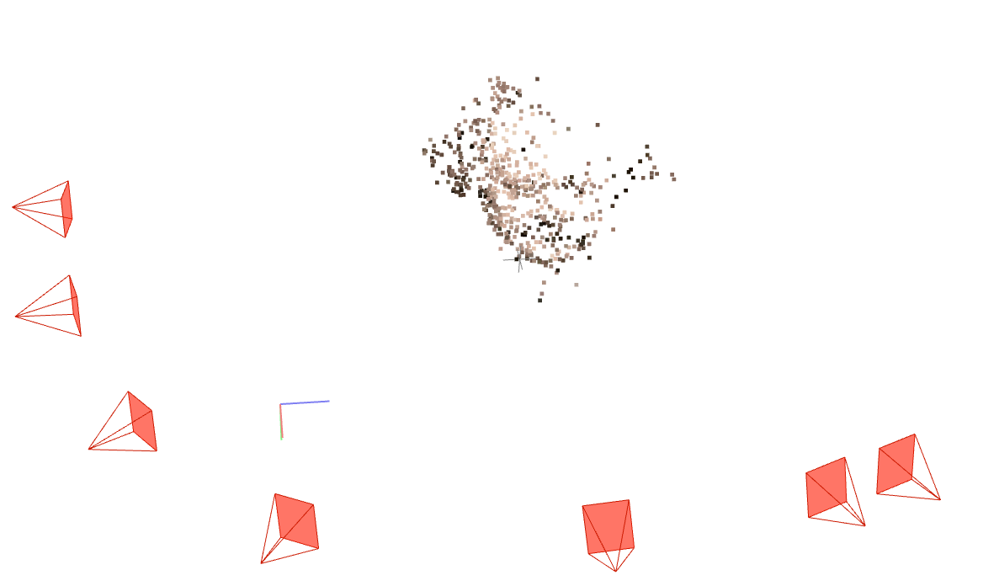
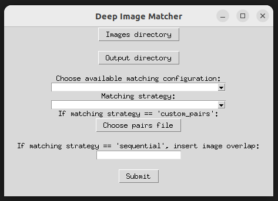

[](https://github.com/colmap/colmap) [](https://github.com/kornia/kornia) [](https://github.com/kornia/kornia)

## DEEP-IMAGE-MATCHING


|   SIFT                      |   DISK                      |   DISK                           |
| ----------------------------| ----------------------------| ---------------------------------|
|  |  |  |


Multivew matcher for COLMAP. Support both deep-learning based and hand-crafted local features and matchers and export keypoints and matches directly in a COLMAP database or to Agisoft Metashape by importing the reconstruction in Bundler format. It supports both CLI and GUI. Feel free to collaborate!

Key features:

- [x] Multiview
- [x] Large format images
- [x] SOTA deep-learning and hand-crafted features
- [x] Full combatibility with COLMAP
- [x] Support for image rotations
- [x] Compatibility with Agisoft Metashape
- [x] Support image retrieval with deep-learning local features

Supported extractors:

- [x] SuperPoint
- [x] DISK
- [x] ALIKE
- [x] ALIKED
- [ ] Superpoint free
- [x] KeyNet + OriNet + HardNet8
- [x] ORB (opencv)
- [x] SIFT (opencv)

Matchers:

- [x] Lightglue (with Superpoint, Disk and ALIKED)
- [x] SuperGlue (with Superpoint)
- [x] LoFTR
- [x] Nearest neighbor (with KORNIA Descriptor Matcher)
- [ ] GlueStick
- [X] RoMa


## Install and run

Install in a conda environment:

```bash
conda create -n deep-image-matching python=3.10
conda activate deep-image-matching
```

Install pytorch. See [https://pytorch.org/get-started/locally/#linux-pip](https://pytorch.org/get-started/locally/#linux-pip)

```bash
python -m pip install --upgrade pip
pip install -e .
```

Install hloc (https://github.com/cvg/Hierarchical-Localization/tree/master):
```
git clone --recursive https://github.com/cvg/Hierarchical-Localization/
cd Hierarchical-Localization/
python -m pip install -e .
git submodule update --init --recursive
```

## Example usage

### Sequential matching with LighGlue

Before running check options with `python ./main.py --help`, then:

```bash
python ./main.py  --config superpoint+lightglue --images assets/example_images --outs assets/output --strategy sequential --overlap 1
```

See other examples in run.bat. If you want to customize detector and descpritor options, change default options in config.py.

To run with the GUI:

```bash
python ./main.py --gui
```



### Merging databases with different local features

See scripts in the `./scripts` dir


## TODO:

- [x] Tile processing for high resolution images
- [x] Manage image rotations
- [ ] Add image retrieval with global descriptors
- [x] add GUI
- [x] Add pycolmap compatibility
- [x] Add exporting to Bundler format ready for importing into Metashape (only on linux with pycolmap)
- [ ] Add visualization for extracted features and matches
- [ ] Improve speed (parallization and threading)
- [ ] Autoselect tiling grid in order to fit images in GPU memory
- [ ] Add tests, documentation and examples
- [ ] Apply mask during feature extraction
- [ ] Check scripts


## References

If you find the repository useful for your work consider citing the papers:

```bibtex
@article{morelli2022photogrammetry,
  title={PHOTOGRAMMETRY NOW AND THEN--FROM HAND-CRAFTED TO DEEP-LEARNING TIE POINTS--},
  author={Morelli, Luca and Bellavia, Fabio and Menna, Fabio and Remondino, Fabio},
  journal={The International Archives of the Photogrammetry, Remote Sensing and Spatial Information Sciences},
  volume={48},
  pages={163--170},
  year={2022},
  publisher={Copernicus GmbH}
}
```
```bibtex
@article{ioli2023replicable,
  title={a Replicable Open-Source Multi-Camera System for Low-Cost 4d Glacier Monitoring},
  author={Ioli, F and Bruno, E and Calzolari, D and Galbiati, M and Mannocchi, A and Manzoni, P and Martini, M and Bianchi, A and Cina, A and De Michele, C and others},
  journal={The International Archives of the Photogrammetry, Remote Sensing and Spatial Information Sciences},
  volume={48},
  pages={137--144},
  year={2023},
  publisher={Copernicus GmbH}
}
```
Depending on the options used, consider citing the corresponding work of [KORNIA](https://github.com/kornia/kornia), [HLOC](https://github.com/cvg/Hierarchical-Localizationgithub), and local features.