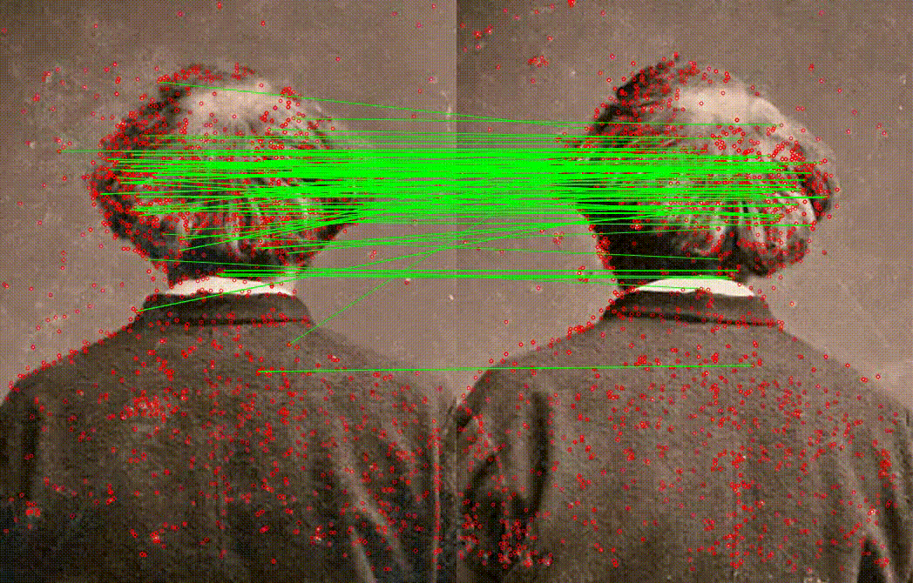
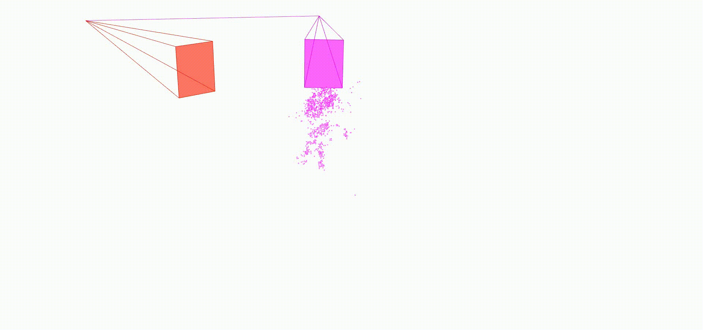

<div align="center">
 
 [](https://github.com/colmap/colmap) [](https://github.com/openMVG/openMVG) [](https://github.com/micmacIGN/micmac)  
 
 [](https://github.com/kornia/kornia) [](https://github.com/kornia/kornia) [](https://github.com/3DOM-FBK/deep-image-matching/releases) [](https://3dom-fbk.github.io/deep-image-matching/)

</div>

# DEEP-IMAGE-MATCHING

| SIFT                                                  | DISK                                                    | IMAGES ORIENTATION                                        | DENSE WITH ROMA                                     |
| ----------------------------------------------------- | ------------------------------------------------------- | --------------------------------------------------------- | --------------------------------------------------- |
|  |  |  |  |

| SIFT                                                  | SUPERGLUE                                                 |
| ----------------------------------------------------- | --------------------------------------------------------- |
|  |  |

Multivew matcher for SfM software. Support both deep-learning based and hand-crafted local features and matchers and export keypoints and matches directly in a COLMAP database or to Agisoft Metashape by importing the reconstruction in Bundler format. Now, it supports both OpenMVG and MicMac. Feel free to collaborate!

While `dev` branch is more frequently updated, `master` is the default more stable branch and is updated from `dev` less frequently. If you are looking for the newest developments, please switch to `dev`. 


For how to use DIM, check the <a href="https://3dom-fbk.github.io/deep-image-matching/">Documentation</a> (updated for the master branch). 


**Please, note that `deep-image-matching` is under active development** and it is still in an experimental stage. If you find any bug, please open an issue.

Key features:

- Multiview
- Large format images
- SOTA deep-learning and hand-crafted features
- Support for image rotations
- Compatibility with several SfM software
- Support image retrieval with deep-learning local features

| Supported Extractors               | Supported Matchers                                        |
| ---------------------------------- | --------------------------------------------------------- |
| &check; SuperPoint                 | &check; Lightglue (with Superpoint, Disk, and ALIKED)     |
| &check; DISK                       | &check; SuperGlue (with Superpoint)                       |
| &#x2610; Superpoint free           | &check; Nearest neighbor (with KORNIA Descriptor Matcher) |
| &check; ALIKE                      | &check; LoFTR (only GPU)                                  |
| &check; ALIKED                     | &check; SE2-LoFTR (no tiling and only GPU)                |
| &check; KeyNet + OriNet + HardNet8 | &check; RoMa                                              |
| &check; DeDoDe (only GPU)          | &#x2610; GlueStick                                        |
| &check; SIFT (from Opencv)         | 
| &check; ORB (from Opencv)          |

| Supported SfM software                        |
| --------------------------------------------- |
| &check; COLMAP                                |
| &check; OpenMVG                               |
| &check; MICMAC                                |
| &check; Agisoft Metashape                     |
| &check; Software that supports bundler format |

## Colab demo and notebooks

Want to run on a sample dataset? ➡️ [](https://colab.research.google.com/github/3DOM-FBK/deep-image-matching/blob/master/notebooks/colab_run_from_bash_example.ipynb)

Want to run on your images? ➡️ [](https://colab.research.google.com/github/3DOM-FBK/deep-image-matching/blob/master/notebooks/colab_run_from_bash_custom_images.ipynb)

DIM can also be utilized as a library instead of being executed through the Command Line Interface (refer to the `Usage Instructions`). For an illustrative example, please see `notebooks/sfm_pipeline.ipynb`.

## Local Installation

For installing deep-image-matching, first create a conda environment:

```
conda create -n deep-image-matching python=3.9
conda activate deep-image-matching
pip install --upgrade pip
```

Clone the repository and install deep-image-matching in editable mode:

```
git clone https://github.com/3DOM-FBK/deep-image-matching.git
cd deep-image-matching
pip install -e .
```

Install pycolmap (optional):

```
pip install pycolmap==0.6.1
```
Pycolmap is optional to run reconstruction directly in DIM. If pycolmap is not available, matches will be written both in a h5 and colmap database for later processing with COLMAP GUI or API, or other processing.

For more information, check the [documentation](https://3dom-fbk.github.io/deep-image-matching/installation/).

## Docker Installation

If you prefer using Docker, first, build the image:

```
docker build --tag deep-image-matching .
```

Note that the first time you run the command, it will take a while to download the base image and install all the dependencies.

Once the image is built, you can run it with the following commands.
On Linux:

```
docker run --name run-deep-image-matching --mount type=bind,source=/home/username/data,target=/workspace/data --gpus all -it deep-image-matching
```

On Windows (please use Powershell):

```
docker run --name run-deep-image-matching --mount type=bind,source=D:\data,target=/workspace/data --gpus all -it deep-image-matching
```

**replace** `/home/username/data` (on Linux) or `D:\data` (on Winows) with the desired path for mounting a shared volume between the local OS and the docker container. Make sure to use absolute paths. This folder will be used to store alll the input data (images) and outputs.

Include the `--detach` option to run the container in background and/or `--rm` to remove container on exit.

Once the container is running, you can then open the repo cloned inside the container directly in VSCode using `ctrl+alt+O` and selecting the option "attach to running container" (make sure to have the Docker extension installed in VSCode), then enjoy!

If you face any issues, especially on Linux when using the `gpus all` setting, please refer to the [documentation](https://3dom-fbk.github.io/deep-image-matching/installation/).

## Usage instructions

<!-- You can run deep-image-matching from the command line or from the GUI. -->

Use the following command to see all the available options from the CLI:

```
python main.py --help
```

For example, to run the matching with SuperPoint and LightGlue on a dataset, you can use the following command:

```
python main.py --dir assets/example_cyprus --pipeline superpoint+lightglue
```

The `--dir` parameter defines the processing directory, where all the results will be saved. This directory must constain a subfolder named **images** in which all the images must be stored. We currentely do not support image retrieval from multiple directories or subdirectories, but we may add this feature in the future. 

The `--pipeline` parameter defines the combaination of local feature extractor and matcher. 

For all the usage instructions and configurations, refer to the [documenation](https://3dom-fbk.github.io/deep-image-matching/getting_started) or check the example notebooks.

<!-- To run the GUI, you can use the following command:

```bash
python main.py --gui
``` -->

## Advanced usage

For advanced usage, please refer to the [documentation](https://3dom-fbk.github.io/deep-image-matching/) and/or check the `scripts` directory.

### Merging databases with different local features

To run the matching with different local features and/or matchers and marging together the results, you can use scripts in the `./scripts` directory for merging the COLMAP databases.

```
python ./join_databases.py --help
python ./join_databases.py --input path/to/dir/with/databases --output path/to/output/dir
```

### Exporting the solution to Metashape

To export the solution to Metashape, you can export the COLMAP database to Bundler format and then import it into Metashape.
This can be done from Metashape GUI, by first importing the images and then use the function `Import Cameras` (File -> Import -> Import Cameras) to select Bundler file (e.g., bundler.out) and the image list file (e.g., bundler_list.txt).

Alternatevely, you can use the `export_to_metashape.py` script to automatically create a Metashape project from a reconstruction saved in Bundler format.
The script `export_to_metashape.py` takes as input the solution in Bundler format and the images and it exports the solution to Metashape.
It requires to install Metashape as a Python module in your environment and to have a valid license.
Please, refer to the instructions at [https://github.com/franioli/metashape](https://github.com/franioli/metashape).

## How to contribute

Any contribution to this repo is really welcome!
If you want to contribute to the project, please, check the [contributing guidelines](./CONTRIBUTING.md).

## To Do List:

See the [TODO list](notes.md) for the list of features and improvements that are planned for the future.

## References

If you find the repository useful for your work consider citing the papers:

```bibtex
@article{morelli2024_deep_image_matching,
  AUTHOR = {Morelli, L. and Ioli, F. and Maiwald, F. and Mazzacca, G. and Menna, F. and Remondino, F.},
  TITLE = {DEEP-IMAGE-MATCHING: A TOOLBOX FOR MULTIVIEW IMAGE MATCHING OF COMPLEX SCENARIOS},
  JOURNAL = {The International Archives of the Photogrammetry, Remote Sensing and Spatial Information Sciences},
  VOLUME = {XLVIII-2/W4-2024},
  YEAR = {2024},
  PAGES = {309--316},
  DOI = {10.5194/isprs-archives-XLVIII-2-W4-2024-309-2024}
}
```

```bibtex
@article{morelli2022photogrammetry,
  title={PHOTOGRAMMETRY NOW AND THEN--FROM HAND-CRAFTED TO DEEP-LEARNING TIE POINTS--},
  author={Morelli, Luca and Bellavia, Fabio and Menna, Fabio and Remondino, Fabio},
  journal={The International Archives of the Photogrammetry, Remote Sensing and Spatial Information Sciences},
  volume={48},
  pages={163--170},
  year={2022},
  publisher={Copernicus GmbH}
}
```

```bibtex
@article{ioli2024,
  title={Deep Learning Low-cost Photogrammetry for 4D Short-term Glacier
Dynamics Monitoring},
  author={Ioli, Francesco and Dematteis, Nicolò and Giordan, Daniele and Nex, Francesco and Pinto Livio},
  journal={PFG – Journal of Photogrammetry, Remote Sensing and Geoinformation Science},
  year={2024},
  DOI = {10.1007/s41064-023-00272-w}
}
```

Depending on the options used, consider citing the corresponding work of:
- [KORNIA](https://github.com/kornia/kornia)
- [HLOC](https://github.com/cvg/Hierarchical-Localization)
- [COLMAP](https://github.com/colmap/colmap)
- [OpenMVG](https://github.com/openMVG/openMVG)
- [MICMAC](https://github.com/micmacIGN/micmac)
- used local features and matchers