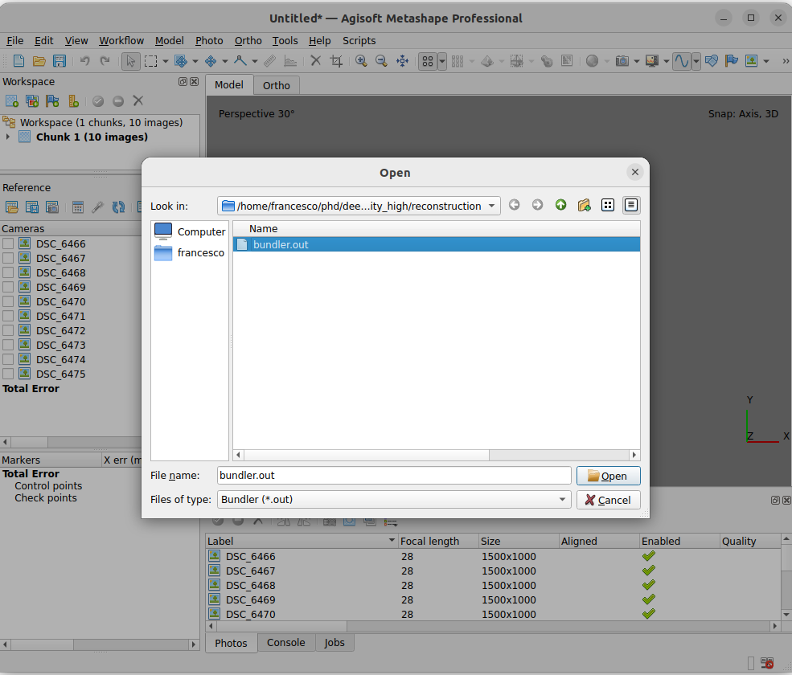
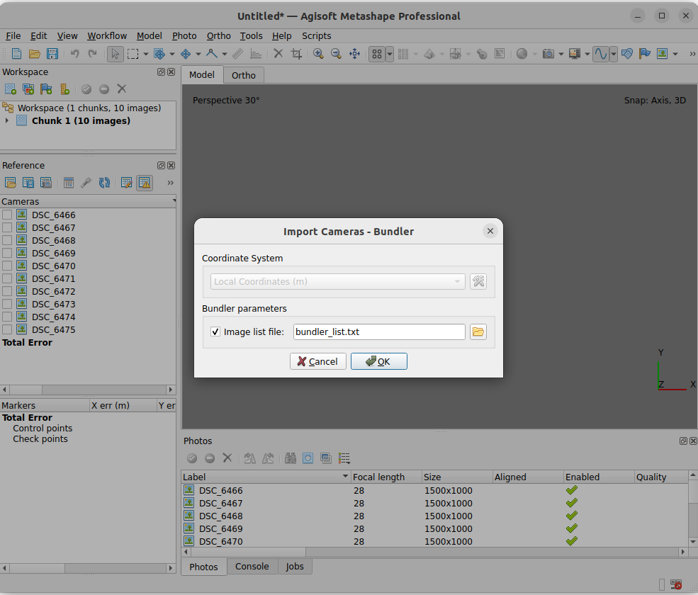
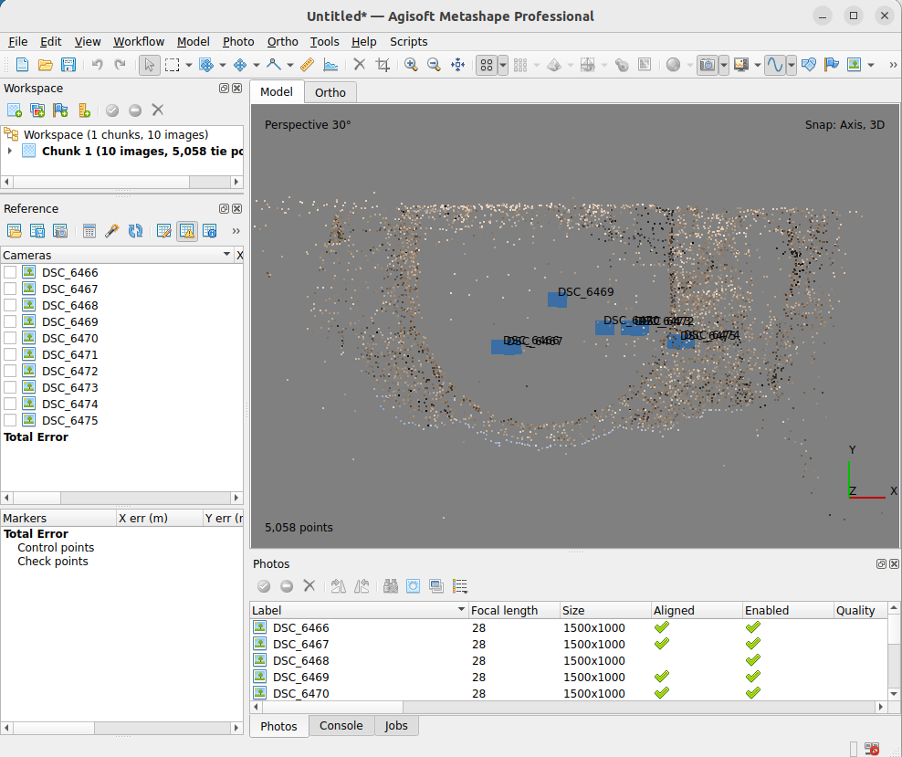
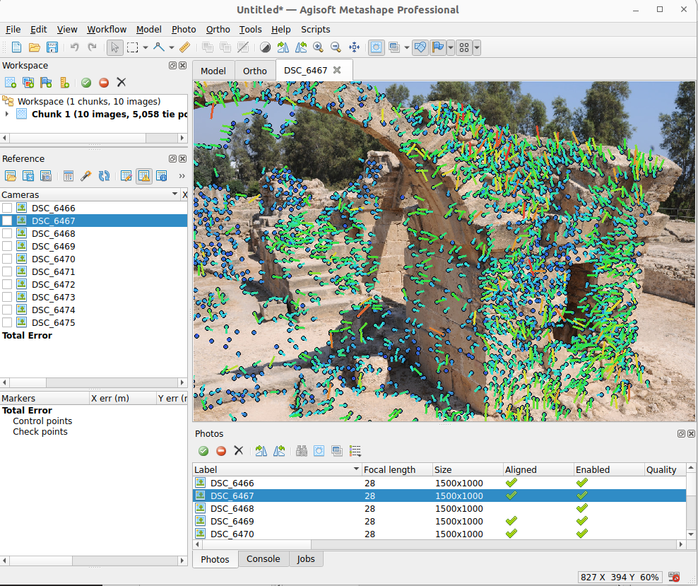

# Agisoft Metashape

In order to import the matches and the camera poses into Agisoft Metashape, you must first run a reconstruction with COLMAP or pyCOLMAP (recommended, as it is already integrated into DIM).
Then, you can export the solution into a [Bundler file format](https://www.cs.cornell.edu/~snavely/bundler/bundler-v0.4-manual.html), which can be imported into Agisoft Metashape.

## Running the reconstruction

To perform an automatic incremental reconstruction with pycolmap, you must first install pycolmap (see [Installation](installation.md)) and then run DIM omitting the `--skip_reconstruction` flag (see [Getting started](getting_started.md)).

```bash
python main.py --dir ./assets/example_cyprus --pipeline superpoint+lightglue
```

This will generate a `reconstruction` folder with the necessary files to import into Agisoft Metashape.

## Importing the solution into Agisoft Metashape

To import the solution into Agisoft Metashape, you have to first load the images into the software (`workflow`-> `add photos`).

Then you can import the solution by importing the camera poses with `File` -> `Import` -> `Import cameras`.
Here you have to select the `bundler.out` file and the `bundler_list.txt` file, and then click `OK





Then you should see the camera poses and the matches between the images.
Note, that the reconstruction is upside down because the Bunlder format uses a different coordinate system than Agisoft Metashape (with the z axis of the cameras pointing backwards).
Therefore, you may have to rotate the reconstruction or to use Ground Control Points (GCPs) to georeference the model.



Opening an image, you can also see the keypoints and the matches between the images.
Note, that the Bunlder camera model is a simple pinhole camera model, so the radial distortion is not taken into account. 
Therefore, you may see large reprojection errors in the images.
To fix this, you should import your camera calibration according to the Metashape camera model and run the bundle adjustment (optimization) again.




## The Bundler file format

The Bundler format is composed of two files: `bundler.out` and `bundler_list.txt`.

The file `bundler.out` contains the camera poses and the matches between the images and it has the following format:

```math
# Bundle file v0.3
<num_cameras> <num_points> 
<camera1> [two integers]
<camera2>
    ...
<cameraN>
<point1>
<point2>
    ...
<pointM>
```

Where `<camera>` is defined as:

```math
    <f> <k1> <k2>   [the focal length, followed by two radial distortion coeffs]
    <R>             [a 3x3 matrix representing the camera rotation]
    <t>             [a 3-vector describing the camera translation]
```

The `<point>` is defined as:

```math
    <position>      [a 3-vector describing the 3D position of the point]
    <color>         [a 3-vector describing the RGB color of the point]
    <view list>     [a list of views the point is visible in]
```

The `<view list>` is defined as:

```math
    <track_length> <camera1> <key1> <x> <y> <camera2> <key2> <x> <y> ... 
```

where `<track_length>` is the number of cameras the point is visible in.
The list is then followed by the camera index, the keypoint index, and the 2D coordinates of the point in the image. 
Both indices are 0-based.

The pixel positions are floating point numbers in a coordinate system where the origin is the center of the image, the x-axis increases to the right, and the y-axis increases towards the top of the image. Thus, (-w/2, -h/2) is the lower-left corner of the image, and (w/2, h/2) is the top-right corner (where w and h are the width and height of the image).

The Bundler format uses a pinhole camera model; the parameters we estimate for each camera are a focal length (f), two radial distortion parameters (k1 and k2), a rotation (R), and translation (t), as described in the file specification above. The formula for projecting a 3D point X into a camera (R, t, f) is:

```math
    P = R * X + t       (conversion from world to camera coordinates)
    p = -P / P.z        (perspective division)
    p' = f * r(p) * p   (conversion to pixel coordinates)
```

Refer to the [Bundler file format](https://www.cs.cornell.edu/~snavely/bundler/bundler-v0.4-manual.html) for more information.

The camera index in `<view list>` is given by the order in which the cameras are listed in the `bundler_list.txt` file, that contains the list of the path of the images used in the reconstruction.
For example:

```math
DSC_6470.JPG
DSC_6474.JPG
DSC_6472.JPG
DSC_6475.JPG
DSC_6469.JPG
DSC_6467.JPG
DSC_6466.JPG
DSC_6473.JPG
```

Note, that if the images are not located in the same folder Agisoft Metashape `.psx` file, you must change the paths in the `bundler_list.txt` file before importing the solution into Agisoft Metashape.
Also, check that the file names in the `bundler_list.txt` file match the actual name of the images (including the extension, with or without capital letters).

An example of the `bundler.out` file is shown below.

<details>

<summary>bundler.out</summary>

```
# Bundle file v0.3
8 5068
1286.7991243248962 0 0
0.99996278884580203 -0.0013121224216955584 -0.0085263860149726069
-0.0013396167178595475 -0.99999391945312011 -0.0032197024452593013
-0.0085221095261131148 0.0032310047256637201 -0.99995846626631835
-0.80777295444200337 0.57663840260582766 -0.15525511334915454
1286.7991243248962 0 0
0.9944298422387321 0.007496545077315649 0.10513368003144505
-0.00055919043698891011 -0.99707818214572397 0.076385770893758309
0.105399127942814 -0.076019079847643029 -0.99152010737453633
-5.1991137793915279 -0.22160254463606963 -0.99094583515584655
1286.7991243248962 0 0
0.99931655217167026 0.006691041857979663 0.036354621639898832
0.0059588178324736507 -0.99977795287841309 0.020212308831227106
0.036481790605243467 -0.019981864204930214 -0.99913452750724763
-2.688138660837613 0.50323354820091459 0.31616042729962252
1286.7991243248962 0 0
0.86929247917708286 -0.054902547052811931 0.491239550497794
-0.08719186547051487 -0.99526046509080457 0.043060251079238297
0.48654718603844849 -0.080264045215458574 -0.86995949262233951
-4.2166603261601505 0.19702147201600073 -2.9468777517136671
1286.7991243248962 0 0
0.99967307085130896 -0.017983902425688095 0.018175001190014438
-0.015758916520280036 -0.99313464826656406 -0.11591042646179414
0.020134745213698173 0.11558611363823715 -0.99309337041850598
1.7882607148764738 2.141918008889161 0.056122945527972187
1286.7991243248962 0 0
0.85443322001495281 0.036474729613622636 -0.51827933263298509
0.069492826027845261 -0.99659260890043411 0.044428808398267128
-0.51489282347450027 -0.07397814531765054 -0.85405656390535267
4.0136035947712356 -0.24890319703929475 -2.2211101146350618
1286.7991243248962 0 0
0.9977349416959288 -0.01781447706336892 0.064866251055384697
-0.023079383925901007 -0.9964189037647786 0.081343163559071466
0.063184872846452397 -0.082655989662913668 -0.99457310400805732
4.744331912881119 -0.67485373536633497 0.50235653241970457
1286.7991243248962 0 0
0.85052582171050761 -0.081299479583431727 0.51961160612820134
-0.076379298718601996 -0.99659964940906087 -0.030908599531384154
0.52035759755279865 -0.013399008067766919 -0.85384333296681514
-2.2708756404217185 0.73112594627182004 -0.97801981077545186
-5.3552997586126736 3.9693405899589074 17.493979792539214
214 196 176
11 0 2597 -460 -250 2 3174 -542 -230 3 2736 -29 -155 4 3531 -250 -282 7 1696 137 -230 0 3358 -465 -253 1 2367 -582 -191 2 3161 -546 -233 3 3431 -33 -156 4 2278 -254 -284 6 2214 33 -227
-12.097171629638927 3.302074646768081 30.280100026537617
227 202 180
2 1 2418 -555 -46 7 4066 113 -101
-5.8312471874484419 -1.9822562893941618 14.437672933948106
116 80 51
3 0 3207 -598 226 2 2420 -722 245 7 3861 35 212
0.46832749086366926 4.3310105451941983 16.298232232524828
198 180 153
...
```

</details>

