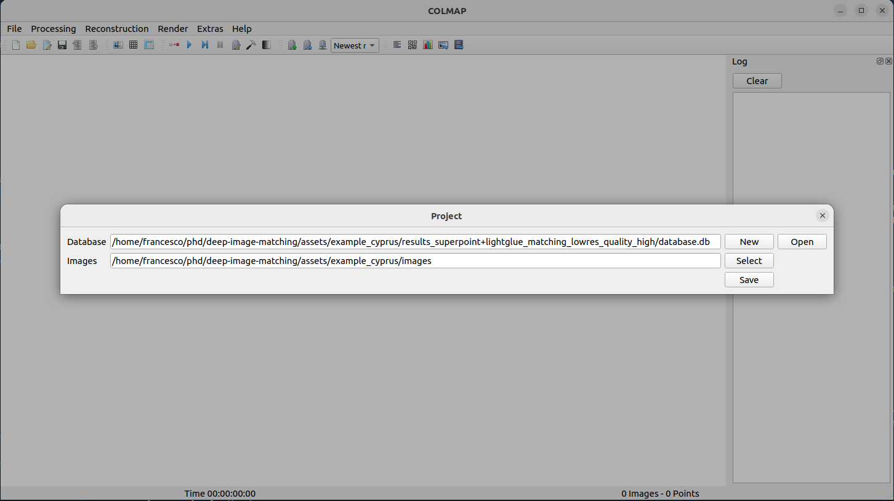
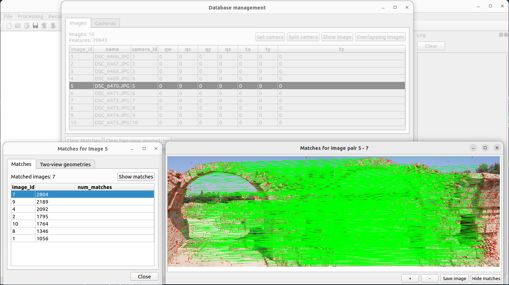

# Use with COLMAP and pyCOLMAP

## COLMAP 

COLMAP is a general-purpose Structure-from-Motion (SfM) and Multi-View Stereo (MVS) pipeline with a graphical and command-line interface. It offers a wide range of features for reconstruction of ordered and unordered image collections. COLMAP is available for Windows, Mac, and Linux.

Deep-Image-Matching saves the results in a sqlite database that database can be directly used with COLMAP to visualize the matches and run the reconstruction.

### Installation

If you don't have COLMAP installed with the GUI, refer to the instructions at [https://colmap.github.io/install.html](https://colmap.github.io/install.html).

### Project Setup

* Launch COLMAP GUI
* Go to `File` > `New project`
* Open the sqlite database `database.db` file in your project's result folder (`Database` > `Open`)
* Select your project's  `images` folder (`Images` > `Select`)
* Click `Save`




### View Matches

You can then use the `Database Management` tab to explore the matches for each image pair.

* Go to `Processing` > `Database Management`
* Pick an image and click `Overlapping images` (top right)
* Select the `Two-view geometries` tab
* Choose an overlapping image's `id` and click `Show matches`



## pyCOLMAP

pyCOLMAP is a python wrapper for COLMAP, it can be used to load and manipulate an existing COLMAP reconstruction.

To run the reconstruction with pyCOLMAP, you must install it first:
```bash
pip install pycolmap==0.6.1
```

and run Deep-Image-Matching without the `--skip-reconstruction` flag, to save the reconstruction is carried out by pycolmap directly.

```bash
python main.py --dir assets/example_cyprus --pipeline superpoint+lightglue
```

Then you can use the following code to load the reconstruction and manipulate it:

```python
import pycolmap
reconstruction = pycolmap.Reconstruction("path/to/reconstruction/dir")
print(reconstruction.summary())

for image_id, image in reconstruction.images.items():
    print(image_id, image)

for point3D_id, point3D in reconstruction.points3D.items():
    print(point3D_id, point3D)

for camera_id, camera in reconstruction.cameras.items():
    print(camera_id, camera)

reconstruction.write("path/to/reconstruction/dir/")
```
