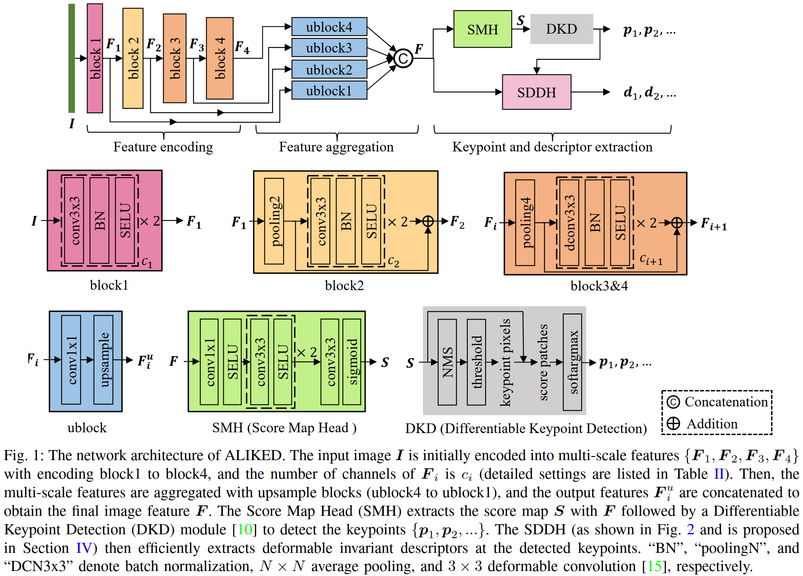
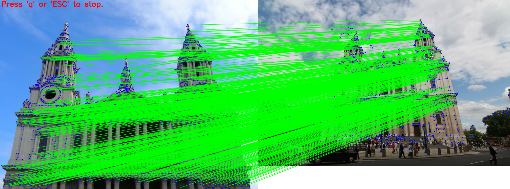
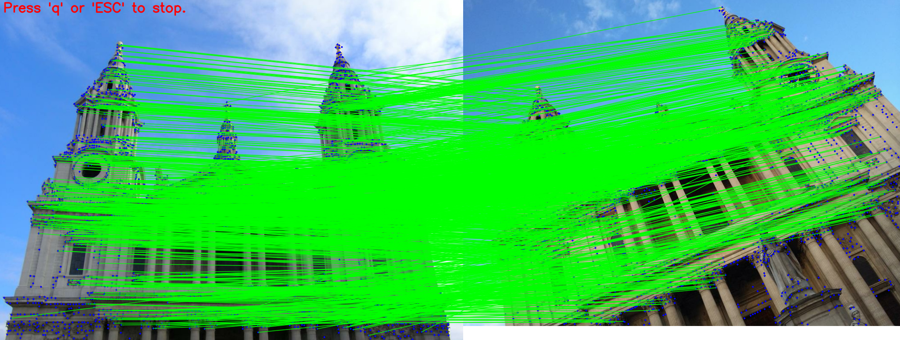
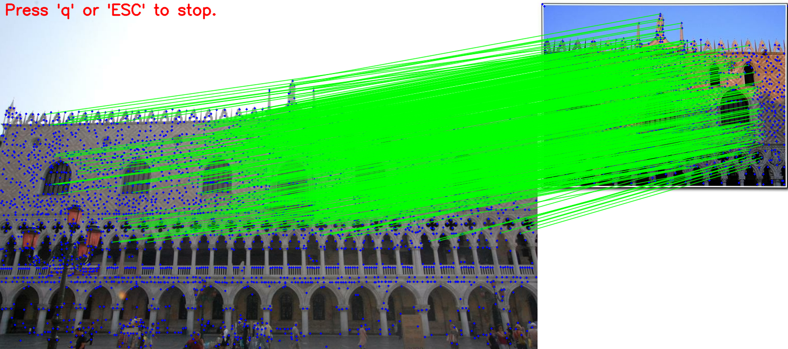
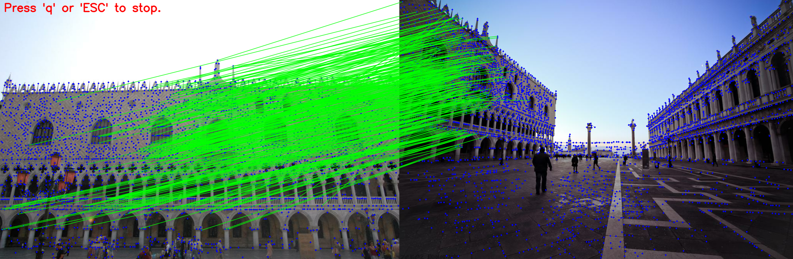
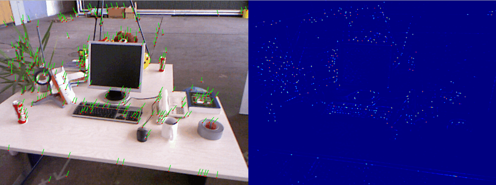
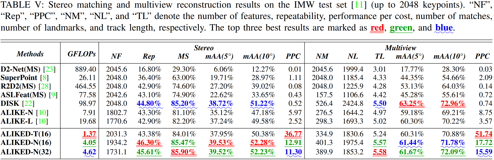
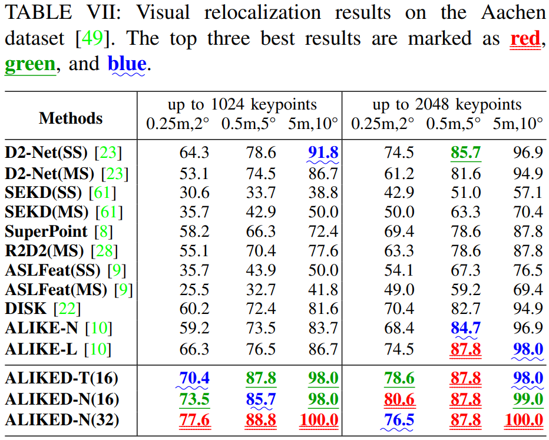

# ALIKED: A Lighter Keypoint and Descriptor Extraction Network via Deformable Transformation

ALIKED is an improvement on [ALIKE](https://github.com/Shiaoming/ALIKE), which introduces the Sparse Deformable Descriptor Head (SDDH) to efficiently extract deformable descriptors. Compared with ALIKE, ALIKED can extract more robust descriptors in a more efficient way. The technical details are described in [this paper](https://arxiv.org/pdf/2304.03608.pdf).

> ```
> Xiaoming Zhao, Xingming Wu, Weihai Chen, Peter C.Y. Chen, Qingsong Xu, and Zhengguo Li, "ALIKED: A Lighter Keypoint and Descriptor Extraction Network via Deformable Transformation", IEEE Transactions on Instrumentation & Measurement, 2023.
> ```

<br/>

If you use ALIKED in academic work, please cite:

```
@article{Zhao2023ALIKED,
    title = {ALIKED: A Lighter Keypoint and Descriptor Extraction Network via Deformable Transformation},
    url = {https://arxiv.org/pdf/2304.03608.pdf},
    doi = {10.1109/TIM.2023.3271000},
    journal = {IEEE Transactions on Instrumentation & Measurement},
    author = {Zhao, Xiaoming and Wu, Xingming and Chen, Weihai and Chen, Peter C. Y. and Xu, Qingsong and Li, Zhengguo},
    year = {2023},
    volume = {72},
    pages = {1-16},
}

@article{Zhao2022ALIKE,
    title = {ALIKE: Accurate and Lightweight Keypoint Detection and Descriptor Extraction},
    url = {http://arxiv.org/abs/2112.02906},
    doi = {10.1109/TMM.2022.3155927},
    journal = {IEEE Transactions on Multimedia},
    author = {Zhao, Xiaoming and Wu, Xingming and Miao, Jinyu and Chen, Weihai and Chen, Peter C. Y. and Li, Zhengguo},
    month = march,
    year = {2022},
}
```


## 1. Prerequisites

The required packages are listed in the `requirements.txt` :

```shell
pip install -r requirements.txt
```

Build `custom_ops`:
```shell
cd custom_ops
sh build.sh
```

## 2. Pretrained models

The pretrained ALIKED models are provided in `models/` .


## 3. Demo


### a) image pair demo
**Example:**
```shell
python demo_pair.py assets/st_pauls_cathedral 
```
<br/>
<br/>

```shell
python demo_pair.py assets/piazza_san_marco
```
<br/>
<br/>

**Usage:**

```shell
$ python demo_pair.py -h
usage: demo_pair.py [-h] [--model {aliked-t16,aliked-n16,aliked-n16rot,aliked-n32}] 
                    [--device DEVICE] [--top_k TOP_K] [--scores_th SCORES_TH] 
                    [--n_limit N_LIMIT] input

ALIKED image pair Demo.

positional arguments:
  input                 Image directory.

options:
  -h, --help            show this help message and exit
  --model {aliked-t16,aliked-n16,aliked-n16rot,aliked-n32}
                        The model configuration
  --device DEVICE       Running device (default: cuda).
  --top_k TOP_K         Detect top K keypoints. -1 for threshold based mode, >0 for top K mode. (default: -1)
  --scores_th SCORES_TH
                        Detector score threshold (default: 0.2).
  --n_limit N_LIMIT     Maximum number of keypoints to be detected (default: 5000).
```

### b) sequence demo
**Example:**
```shell
python demo_seq.py assets/tum 
```
<br/>

**Usage:**
```shell
$ python demo_seq.py -h
usage: demo_seq.py [-h] [--model {aliked-t16,aliked-n16,aliked-n16rot,aliked-n32}] 
                   [--device DEVICE] [--top_k TOP_K] [--scores_th SCORES_TH] 
                   [--n_limit N_LIMIT] [--no_display] input

ALIKED sequence Demo.

positional arguments:
  input                 Image directory or movie file or "camera0" (for webcam0).

options:
  -h, --help            show this help message and exit
  --model {aliked-t16,aliked-n16,aliked-n16rot,aliked-n32}
                        The model configuration
  --device DEVICE       Running device (default: cuda).
  --top_k TOP_K         Detect top K keypoints. -1 for threshold based mode, >0 for top K mode. (default: -1)
  --scores_th SCORES_TH
                        Detector score threshold (default: 0.2).
  --n_limit N_LIMIT     Maximum number of keypoints to be detected (default: 5000).
  --no_display          Do not display images to screen. Useful if running remotely (default: False).
```

## 4. Efficiency and performance

### Image matching & multiview reconstruction

<br/>

### Relocalization

<br/>


## 5. Limitations

- The `aliked-n16rot` is trained with rotation augmentation, it can handle some image rotation and is more stable on viewpoint change. But it can still have difficulty on large image rotations.
- ALIKED is detector-based, and it is designed as light-weight as possible, so it is not comparable with the detector-free methods.
- The training code: I am sorry that I am not allowed to publish the training code of ALIKED, you can refer to the [training code of ALIKE](https://github.com/Shiaoming/ALIKE/raw/main/assets/ALIKE_code.zip).

For more details, please refer to the [paper](https://arxiv.org/pdf/2304.03608.pdf).
