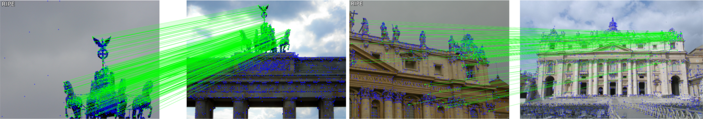

#
<p align="center">
  <h1 align="center"> <ins>RIPE</ins>:<br> Reinforcement Learning on Unlabeled Image Pairs for Robust Keypoint Extraction <br><br>🌊🌺 ICCV 2025 🌺🌊</h1>
  <p align="center">
    <a href="https://scholar.google.com/citations?user=ybMR38kAAAAJ">Johannes Künzel</a>
    ·
    <a href="https://scholar.google.com/citations?user=5yTuyGIAAAAJ">Anna Hilsmann</a>
    ·
    <a href="https://scholar.google.com/citations?user=BCElyCkAAAAJ">Peter Eisert</a>
  </p>
  <h2 align="center"><p>
    <a href="https://arxiv.org/abs/2507.04839" align="center">Arxiv</a> | 
    <a href="https://fraunhoferhhi.github.io/RIPE/" align="center">Project Page</a> |
    <a href="https://huggingface.co/spaces/JohannesK14/RIPE" align="center">🤗Demo🤗</a>
  </p></h2>  
  <div align="center"></div>
</p>
<br/>
<p align="center">
    
    <br>
    <em>RIPE demonstrates that keypoint detection and description can be learned from image pairs only - no depth, no pose, no artificial augmentation required.</em>
</p>

## Setup

💡**Alternative**💡 Install nothing locally and try our Hugging Face demo: [🤗Demo🤗](https://huggingface.co/spaces/JohannesK14/RIPE)

1. Install mamba by following the instructions given here: [Mamba Installation](https://mamba.readthedocs.io/en/latest/installation/mamba-installation.html)

2. Create a new environment with:
```bash
mamba create -f conda_env.yml
mamba activate ripe-env
```

## How to use

Or just check [demo.py](demo.py)

```python
import cv2
import kornia.feature as KF
import kornia.geometry as KG
import matplotlib.pyplot as plt
import numpy as np
import torch
from torchvision.io import decode_image

from ripe import vgg_hyper
from ripe.utils.utils import cv2_matches_from_kornia, resize_image, to_cv_kpts

dev = torch.device("cuda" if torch.cuda.is_available() else "cpu")

model = vgg_hyper().to(dev)
model.eval()

image1 = resize_image(decode_image("assets/all_souls_000013.jpg").float().to(dev) / 255.0)
image2 = resize_image(decode_image("assets/all_souls_000055.jpg").float().to(dev) / 255.0)

kpts_1, desc_1, score_1 = model.detectAndCompute(image1, threshold=0.5, top_k=2048)
kpts_2, desc_2, score_2 = model.detectAndCompute(image2, threshold=0.5, top_k=2048)

matcher = KF.DescriptorMatcher("mnn")  # threshold is not used with mnn
match_dists, match_idxs = matcher(desc_1, desc_2)

matched_pts_1 = kpts_1[match_idxs[:, 0]]
matched_pts_2 = kpts_2[match_idxs[:, 1]]

H, mask = KG.ransac.RANSAC(model_type="fundamental", inl_th=1.0)(matched_pts_1, matched_pts_2)
matchesMask = mask.int().ravel().tolist()

result_ransac = cv2.drawMatches(
    (image1.cpu().permute(1, 2, 0).numpy() * 255.0).astype(np.uint8),
    to_cv_kpts(kpts_1, score_1),
    (image2.cpu().permute(1, 2, 0).numpy() * 255.0).astype(np.uint8),
    to_cv_kpts(kpts_2, score_2),
    cv2_matches_from_kornia(match_dists, match_idxs),
    None,
    matchColor=(0, 255, 0),
    matchesMask=matchesMask,
    # matchesMask=None, # without RANSAC filtering
    singlePointColor=(0, 0, 255),
    flags=cv2.DrawMatchesFlags_DEFAULT,
)

plt.imshow(result_ransac)
plt.axis("off")
plt.tight_layout()

plt.show()
# plt.savefig("result_ransac.png")
```

## Reproduce the results

### MegaDepth 1500 & HPatches

1. Download and install [Glue Factory](https://github.com/cvg/glue-factory)
2. Add this repo as a submodule to Glue Factory:
```bash
cd glue-factory
git submodule add https://github.com/fraunhoferhhi/RIPE.git thirdparty/ripe
```
3. Create the new file ripe.py under gluefactory/models/extractors/ with the following content:

    <details>
    <summary>ripe.py</summary>

    ```python
    import sys
    from pathlib import Path

    import torch
    import torchvision.transforms as transforms

    from ..base_model import BaseModel

    ripe_path = Path(__file__).parent / "../../../thirdparty/ripe"

    print(f"RIPE Path: {ripe_path.resolve()}")
    # check if the path exists
    if not ripe_path.exists():
        raise RuntimeError(f"RIPE path not found: {ripe_path}")

    sys.path.append(str(ripe_path))

    from ripe import vgg_hyper


    class RIPE(BaseModel):
        default_conf = {
            "name": "RIPE",
            "model_path": None,
            "chunk": 4,
            "dense_outputs": False,
            "threshold": 1.0,
            "top_k": 2048,
        }

        required_data_keys = ["image"]

        # Initialize the line matcher
        def _init(self, conf):
            self.normalizer = transforms.Normalize(mean=[0.485, 0.456, 0.406], std=[0.229, 0.224, 0.225])
            self.model = vgg_hyper(model_path=conf.model_path)
            self.model.eval()

            self.set_initialized()

        def _forward(self, data):
            image = data["image"]

            keypoints, scores, descriptors = [], [], []

            chunk = self.conf.chunk

            for i in range(0, image.shape[0], chunk):
                if self.conf.dense_outputs:
                    raise NotImplementedError("Dense outputs are not supported")
                else:
                    im = image[: min(image.shape[0], i + chunk)]
                    im = self.normalizer(im)

                    H, W = im.shape[-2:]

                    kpt, desc, score = self.model.detectAndCompute(
                        im,
                        threshold=self.conf.threshold,
                        top_k=self.conf.top_k,
                    )
                keypoints += [kpt.squeeze(0)]
                scores += [score.squeeze(0)]
                descriptors += [desc.squeeze(0)]

                del kpt
                del desc
                del score

            keypoints = torch.stack(keypoints, 0)
            scores = torch.stack(scores, 0)
            descriptors = torch.stack(descriptors, 0)

            pred = {
                # "keypoints": keypoints.to(image) + 0.5,
                "keypoints": keypoints.to(image),
                "keypoint_scores": scores.to(image),
                "descriptors": descriptors.to(image),
            }

            return pred

        def loss(self, pred, data):
            raise NotImplementedError
    ```

    </details>

4. Create ripe+NN.yaml in gluefactory/configs with the following content:

    <details>
    <summary>ripe+NN.yaml</summary>

    ```yaml
    model:
        name: two_view_pipeline
        extractor:
            name: extractors.ripe
            threshold: 1.0
            top_k: 2048
        matcher:
            name: matchers.nearest_neighbor_matcher
    benchmarks:
        megadepth1500:
          data:
            preprocessing:
              side: long
              resize: 1600
          eval:
            estimator: poselib
            ransac_th: 0.5
        hpatches:
          eval:
            estimator: poselib
            ransac_th: 0.5
          model:
            extractor:
              top_k: 1024  # overwrite config above
    ```

5. Run the MegaDepth 1500 evaluation script:

```bash
python -m gluefactory.eval.megadepth1500 --conf ripe+NN # for MegaDepth 1500
```

Should result in: 

```bash
'rel_pose_error@10°': 0.6834,
'rel_pose_error@20°': 0.7803,
'rel_pose_error@5°': 0.5511,
```

6. Run the HPatches evaluation script:

```bash
python -m gluefactory.eval.hpatches --conf ripe+NN # for HPatches
```

Should result in:

```bash
'H_error_ransac@1px': 0.3793,
'H_error_ransac@3px': 0.5893,
'H_error_ransac@5px': 0.692,
```


## Training

1. Create a .env file with the following content:
```bash
OUTPUT_DIR="/output"
DATA_DIR="/data"
```

2. Download the required datasets:
        
    <details>
    <summary>DISK Megadepth subset</summary>

    To download the dataset used by [DISK](https://github.com/cvlab-epfl/disk) execute the following commands:

    ```bash
    cd data
    bash download_disk_data.sh
    ```

    </details>

    <details>
    <summary>Tokyo 24/7 Query V3</summary>

    - ⚠️**Optional**⚠️: Only if you are interest in the model used in Section 4.6 of the paper!
    - Download the Tokyo 24/7 query images from here: [Tokyo 24/7 Query Images V3](http://www.ok.ctrl.titech.ac.jp/~torii/project/247/download/247query_v3.zip) from the official [website](http://www.ok.ctrl.titech.ac.jp/~torii/project/247/_).
    - extract them into data/Tokyo_Query_V3

    ```bash
    Tokyo_Query_V3/
    ├── 00001.csv
    ├── 00001.jpg
    ├── 00002.csv
    ├── 00002.jpg
    ├── ...
    ├── 01125.csv
    ├── 01125.jpg
    ├── Readme.txt
    └── Readme.txt~
    ```

    </details>

    <details>
    <summary>ACDC</summary>

    - ⚠️**Optional**⚠️: Only if you are interest in the model used in Section 6.1 (supplementary) of the paper!
    - Download the RGB images from here: [ACDC RGB Images](https://acdc.vision.ee.ethz.ch/rgb_anon_trainvaltest.zip)
    - extract them into data/ACDC

    ```bash
    ACDC/
    rgb_anon
    ├── fog
    │   ├── test
    │   │   ├── GOPR0475
    │   │   ├── GOPR0477
    │   ├── test_ref
    │   │   ├── GOPR0475
    │   │   ├── GOPR0477
    │   ├── train
    │   │   ├── GOPR0475
    │   │   ├── GOPR0476
    ├── night
    ```

    </details>

3. Run the training script:

```bash
python ripe/train.py --config-name train project_name=train name=reproduce wandb_mode=offline
```

You can also easily switch setting from the command line, e.g. to addionally train on the Tokyo 24/7 dataset:
```bash
python ripe/train.py --config-name train project_name=train name=reproduce wandb_mode=offline data=megadepth+tokyo
```

## Acknowledgements

Our code is partly based on the following repositories:
- [DALF](https://github.com/verlab/DALF_CVPR_2023) Apache License 2.0
- [DeDoDe](https://github.com/Parskatt/DeDoDe) MIT License
- [DISK](https://github.com/cvlab-epfl/disk) Apache License 2.0

Our evaluation was based on the following repositories:
- [Glue Factory](https://github.com/cvg/glue-factory)
- [hloc](https://github.com/cvg/Hierarchical-Localization)

We would like to thank the authors of these repositories for their great work and for making their code available.

Our project webpage is based on the [Acadamic Project Page Template](https://github.com/eliahuhorwitz/Academic-project-page-template) by Eliahu Horwitz.

## BibTex Citation

```

@article{ripe2025, 
year = {2025}, 
title = {{RIPE: Reinforcement Learning on Unlabeled Image Pairs for Robust Keypoint Extraction}}, 
author = {Künzel, Johannes and Hilsmann, Anna and Eisert, Peter}, 
journal = {arXiv}, 
eprint = {2507.04839}, 
}
```
