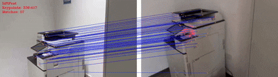
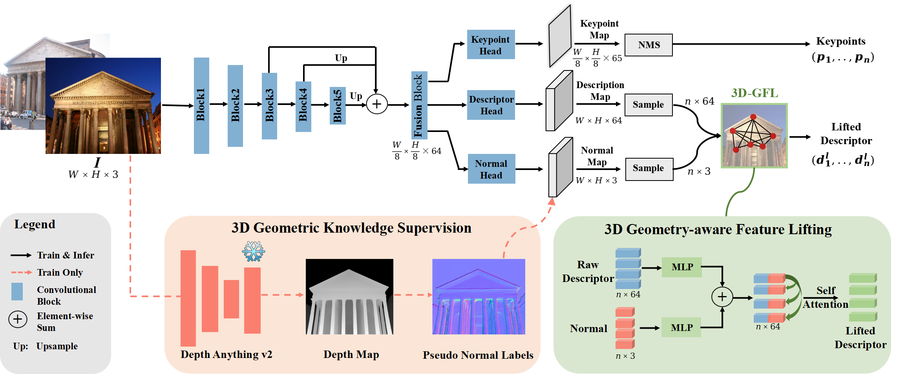
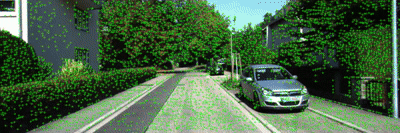
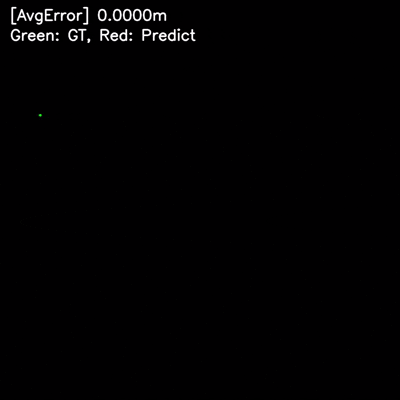

## LiftFeat: 3D Geometry-Aware Local Feature Matching  
<div align="center" style="display: flex; justify-content: center; align-items: center; flex-direction: column;">
  <div style="display: flex; justify-content: space-around; width: 100%;">
    
    
  </div>
  
  Real-time SuperPoint demonstration (left) compared to LiftFeat (right) on a textureless scene. 
  
</div>

- 🎉 **New!** Training code is now available 🚀
- 🎉 **New!** The test code and pretrained model have been released. 🚀

## Table of Contents
- [Introduction](#introduction)
- [Installation](#installation)
- [Usage](#usage)
 - [Inference](#inference)
 - [Training](#training)
 - [Evaluation](#evaluation)
- [Citation](#citation)
- [License](#license)

## Introduction
This repository contains the official implementation of the paper:  
**[LiftFeat: 3D Geometry-Aware Local Feature Matching](https://www.arxiv.org/abs/2505.03422)**, to be presented at *ICRA 2025*.

**Overview of LiftFeat's achitecture**
<div style="background-color:white">
    
</div>

LiftFeat is a lightweight and robust local feature matching network designed to handle challenging scenarios such as drastic lighting changes, low-texture regions, and repetitive patterns. By incorporating 3D geometric cues through surface normals predicted from monocular depth, LiftFeat enhances the discriminative power of 2D descriptors. Our proposed 3D geometry-aware feature lifting module effectively fuses these cues, leading to significant improvements in tasks like relative pose estimation, homography estimation, and visual localization.

## Installation
If you use conda as virtual environment,you can create a new env with:
```bash
git clone https://github.com/lyp-deeplearning/LiftFeat.git
cd LiftFeat
conda create -n LiftFeat python=3.8
conda activate LiftFeat
pip install -r requirements.txt
```

## Usage
### Inference with image pair
To run LiftFeat on an image,you can simply run with:
```bash
python demo.py --img1=<reference image> --img2=<query image>
```

### Run with video
We provide a simple real-time demo that matches a template image to each frame of a video stream using our LiftFeat method.

You can run the demo with the following command:
```bash
python tools/demo_match_video.py --img your_template.png --video your.mp4
```

We also provide a [sample template image and video with lighting variation](https://drive.google.com/drive/folders/1b-t-f2Bt47KU674bPI09bGtJ9BHx05Yu?usp=drive_link) for demonstration purposes.

### Visual Odometry Demo
We have added a new application to evaluate LiftFeat on visual odometry (VO) tasks.

We use sequences from the KITTI dataset to demonstrate frame-to-frame motion estimation. Running the script below will generate the estimated camera trajectory and the error curve:

```bash
python tools/demo_vo.py --path1 /path/to/gray/images --path2 /path/to/color/images --id 03
```

We also provide a sample [KITTI sequence](https://drive.google.com/drive/folders/1b-t-f2Bt47KU674bPI09bGtJ9BHx05Yu?usp=drive_link) for quick testing.

<div style="display: flex; justify-content: space-around; width: 100%;">
    
    
  </div>


## Training
To train LiftFeat as described in the paper, you will need MegaDepth & COCO_20k subset of COCO2017 dataset as described in the paper *[XFeat: Accelerated Features for Lightweight Image Matching](https://arxiv.org/abs/2404.19174)*
You can obtain the full COCO2017 train data at https://cocodataset.org/.
However, we [make available](https://drive.google.com/file/d/1ijYsPq7dtLQSl-oEsUOGH1fAy21YLc7H/view?usp=drive_link) a subset of COCO for convenience. We simply selected a subset of 20k images according to image resolution. Please check COCO [terms of use](https://cocodataset.org/#termsofuse) before using the data.

To reproduce the training setup from the paper, please follow the steps:
1. Download [COCO_20k](https://drive.google.com/file/d/1ijYsPq7dtLQSl-oEsUOGH1fAy21YLc7H/view?usp=drive_link) containing a subset of COCO2017;
2. Download MegaDepth dataset. You can follow [LoFTR instructions](https://github.com/zju3dv/LoFTR/blob/master/docs/TRAINING.md#download-datasets), we use the same standard as LoFTR. Then put the megadepth indices inside the MegaDepth root folder following the standard below:
```bash
{megadepth_root_path}/train_data/megadepth_indices #indices
{megadepth_root_path}/MegaDepth_v1 #images & depth maps & poses
```
3. Finally you can call training
```bash
python train.py --megadepth_root_path <path_to>/MegaDepth --synthetic_root_path <path_to>/coco_20k --ckpt_save_path /path/to/ckpts
```

### Evaluation
All evaluation code are in *evaluation*, you can download **HPatch** dataset following [D2-Net](https://github.com/mihaidusmanu/d2-net/tree/master) and download **MegaDepth** test dataset following [LoFTR](https://github.com/zju3dv/LoFTR/tree/master).

**Download and process HPatch**
```bash
cd /data

# Download the dataset
wget https://huggingface.co/datasets/vbalnt/hpatches/resolve/main/hpatches-sequences-release.zip

# Extract the dataset
unzip hpatches-sequences-release.zip

# Remove the high-resolution sequences
cd hpatches-sequences-release
rm -rf i_contruction i_crownnight i_dc i_pencils i_whitebuilding v_artisans v_astronautis v_talent

cd <LiftFeat>/data

ln -s /data/hpatches-sequences-release ./HPatch
```

**Download and process MegaDepth1500**  
We provide download link to [megadepth_test_1500](https://drive.google.com/drive/folders/1nTkK1485FuwqA0DbZrK2Cl0WnXadUZdc)
```bash
tar xvf <path to megadepth_test_1500.tar>

cd <LiftFeat>/data

ln -s <path to megadepth_test_1500> ./megadepth_test_1500
```


**Homography Estimation**
```bash
python evaluation/HPatch_evaluation.py
```

**Relative Pose Estimation**

For *Megadepth1500* dataset:
```bash
python evaluation/MegaDepth1500_evaluation.py
```


## Citation
If you find this code useful for your research, please cite the paper:
```bibtex
@INPROCEEDINGS{11127853,
  author={Liu, Yepeng and Lai, Wenpeng and Zhao, Zhou and Xiong, Yuxuan and Zhu, Jinchi and Cheng, Jun and Xu, Yongchao},
  booktitle={2025 IEEE International Conference on Robotics and Automation (ICRA)}, 
  title={LiftFeat: 3D Geometry-Aware Local Feature Matching}, 
  year={2025},
  volume={},
  number={},
  pages={11714-11720},
  doi={10.1109/ICRA55743.2025.11127853}
}
```

## License
[](LICENSE)


## Acknowledgements
We would like to thank the authors of the following open-source repositories for their valuable contributions, which have inspired or supported this work:

- [verlab/accelerated_features](https://github.com/verlab/accelerated_features)
- [zju3dv/LoFTR](https://github.com/zju3dv/LoFTR)
- [rpautrat/SuperPoint](https://github.com/rpautrat/SuperPoint)
- [Depth-Anything-V2](https://github.com/DepthAnything/Depth-Anything-V2)
- [Python-VO](https://github.com/Shiaoming/Python-VO)

We deeply appreciate the efforts of the research community in releasing high-quality codebases.
